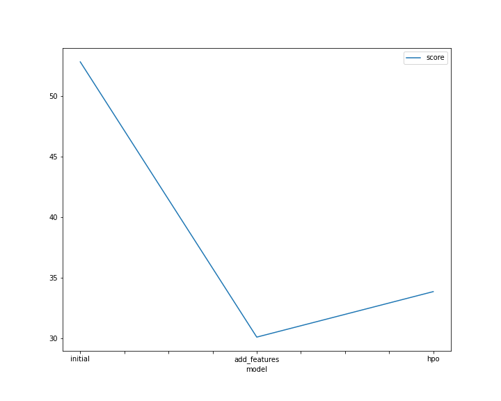
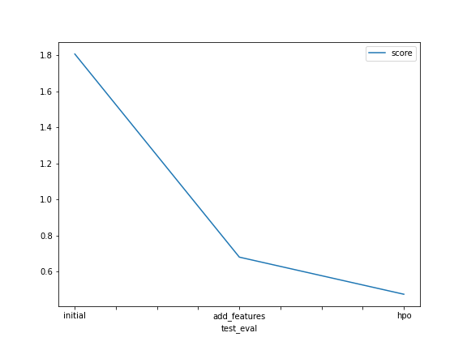

# Report: Predict Bike Sharing Demand with AutoGluon Solution

#### Manish Panjwani

## Initial Training

### What did you realize when you tried to submit your predictions? What changes were needed to the output of the predictor to submit your results?

I had to fix some syntax errors and review additional documentation in order to run the model as intended. I had some trouble starting the tasks on my local environment and I decided to do everything in the SageMaker studio and managed to improve my results and get a score of below 0.47553 with hyperparameters .

### What was the top ranked model that performed?

My top score was achieved my the completing in last run with hyperparameters with features. The score was 0.47553 and was better than the one without anything and only with features. WeightedEnsemble_L3 is the model that performed well

## Exploratory data analysis and feature creation

### What did the exploratory analysis find and how did you add additional features?

I managed to derive from the distriutions that the temperature categories were normally distributed. The datetime needed to be split into more features and I chose to split it into year, month, day and hour which is what improve my model the most. About the season I suppose that we see the four seasons in the distribution and it is the same for the weather which has three categories of input. Workday and holiday are both binary fields and humidity and windspeed are left and right skewed respectively.

### How much better did your model preform after adding additional features and why do you think that is?

Adding features reduced the over all score but didn't reduced to less than 0.5

## Hyper parameter tuning

### How much better did your model preform after trying different hyper parameters?

The model performed much better than with just the features. I followed the suggested hyperparameter improvement for tabular data provided by autogluon. More background information is needed to fine-tune the model and reduce the score even lesser

### If you were given more time with this dataset, where do you think you would spend more time?

I would try to figure out more ways to improve on the features as they seem to be the ones that lead to improvement of the score. Maybe some one-hot encoding or adjusting for the seasons or working hours will provide us with a better result.

### Create a table with the models you ran, the hyperparameters modified, and the kaggle score.

|model|score|
"initial"| 1.80776
"add_features"|0.68131
"hpo"|0.47553

### Create a line plot showing the top model score for the three (or more) training runs during the project.

### Create a line plot showing the top kaggle score for the three (or more) prediction submissions during the project.

## Summary

The most benefit is received by working with the features and you can gain great insights from the EDA. Working forward my goal would be to improve the model by taking into consideration the working hours which impact the bike demand and the seasonal spikes and lows.
